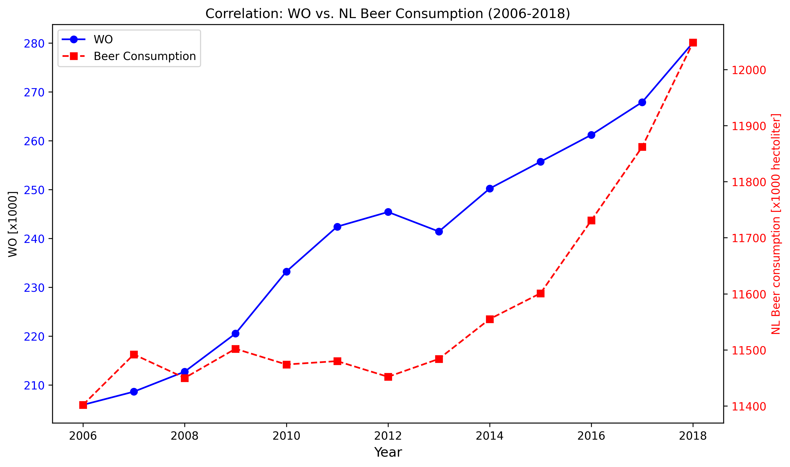

15163423

Fantastic yeasts and where to find them: the hidden diversity of dimorphic fungal pathogens

An analysis of the forces required to drag sheep over various surfaces

The neurocognitive effects of alcohol on adolescents and college students

Overall, both lines showed an upward trend between 2006 and 2018, and both began to rise more rapidly after 2013. This may indicate that, due to economic growth, more students are willing to enroll in universities, while more people are also willing to spend money on beer. However, this does not mean there is a strong correlation between enrollment numbers and beer consumption.
